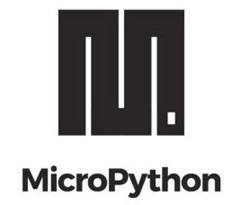

# {: style="width:39px" } OctopusLab

Tohle je základní dokumentace, kde se prolínají [popisy knihoven](/basicdoc), příklady, návody, tutoriály, části workshopů, projektů a ukázek použití.

---


## Vývojové a výukové moduly

Co vlastně děláme? Vymýšlíme různé hardwarové moduly (zaměření na ESP32 a Micropython). Vyrábíme desky plošných spojů, které se dají podle potřeby proměnit v celou řadu zajímavých projektů.
**Námi navržené vývojové a experimentální desky, slouží i jako finálně zapojitelné moduly pro projekty nebo jejich části. Jednoduché (nebo částečně zapojené) projekty výborně pomáhají i při výuce.**
Další informace jsou na našem webu http://www.octopuslab.cz

---

## ESP32

{: style="margin:15px;float:left;" } Na destičce *vypadající jako známka* je mikrokontrolér spolu s několika klíčovými komponenty včetně krystalu, antény pro WiFi a Bluetooth. ESP32 je tak okamžitě připraveno k integraci do koncových produktů.

Podrobnější popis je na samostatné stránce [ESP32](/esp32)

---
## Micropython

{: style="width:90px;float:left;" } Micropython je "odlehčená" verze populárního programovacího jazyka Python. *Je to přesněji softwarová implementace vyššího programovacího jazkyka kompatibilního s Python 3.x. Je napsaný v C a optimalizovaný pro použití v mikrokontrolétech.*

!!! note
      Toto není výuka programování – ale jen ukázky a experimenty s přihlédnutím na sadu knihoven a modulů <b>octopusLab</b> pro práci s vybraným HW.

      Pro podrobnější proniknutí do tajů programování v Pythonu doporučujeme: 

      - [naucse.python.cz](https://naucse.python.cz/)
      - [naucse.python.cz/course/mi-pyt/intro/micropython](https://naucse.python.cz/course/mi-pyt/intro/micropython/)
      - [howto.py.cz](http://howto.py.cz/index.htm)

---

## Jak se zapojit?

```
      ,'''`.
     /      \
     |(@)(@)|
     )      (
    /,'))((`.\
   (( ((  )) ))
   )  \ `)(' / (

 Chobotnice je ráda za každý komentář :like:
```


!!! hint "Open source projekt je založen na spolupráci"
    Všechny podklady tohoto "manuálu" píšeme v [markdownu](https://cs.wikipedia.org/wiki/Markdown) a jsou veřejně na [GitHubu](https://github.com/octopusengine/docs_octopuslab_cz), budeme rádi za vaše připomínky a nápady https://github.com/octopusengine/docs_octopuslab_cz
      
    Každý může navrhovat doplnění, hlásit chyby a libovolným způsobem přispívat. Vždy, když se navrhovaná změna schválí (commit) do hlavní větve (master branch), automaticky se publikuje na těchto stránkách. Budeme rádi, když nám dáte vědět, jak se Vám s naším dokumentem pracuje. Vypadá to jenom jako taková blost, ale fakt to dalo dost práce.
    

{: style="width:90px" } [Co to je? A jak se s ním pracuje?](/github)

Za tým octopusLABu: *Honza Čopák, Petr Kracík, Vašek Chalupníček, Vladimír Jiříček, Jan Češpivo, Milan Špaček, Metěj Suchánek a další*

---